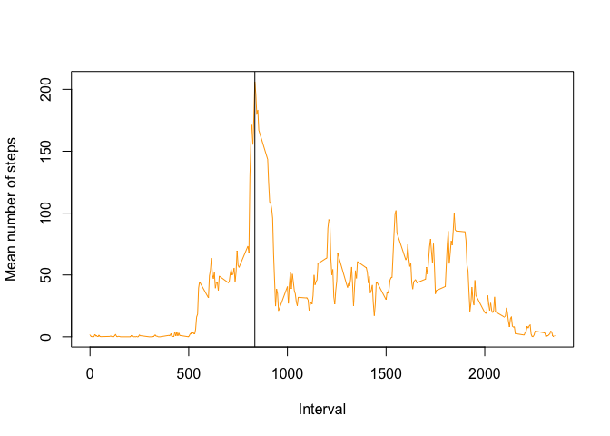
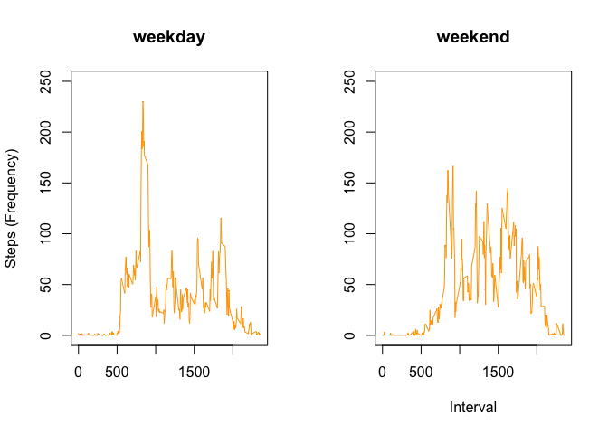

# Reproducible Research: Peer Assessment 1
Delvis  
11 de Outubro de 2014  

## Loading and preprocessing the data
First we unzip and read the data file


```r
data <- unz("repdata_data_activity.zip", "activity.csv")
data <- read.csv(data)
```

## What is mean total number of steps taken per day?

> For this part of the assignment, you can ignore the missing values in the dataset.


```r
daily_steps <- tapply(data$steps, data$date, sum)
daily_steps_mean <- mean(daily_steps, na.rm=TRUE)
daily_steps_median <- median(daily_steps, na.rm=TRUE)
```

> Make a histogram of the total number of steps taken each day


```r
hist(x = daily_steps, xlab = "Number of steps (daily)", col = "orange",
     main="Histogram of the total number of steps taken each day")
rug(daily_steps) + abline(v = daily_steps_mean)
```

 

```
## numeric(0)
```

> Calculate and report the mean and median total number of steps taken per day


```r
daily_steps_mean
```

```
## [1] 10766
```


```r
daily_steps_median
```

```
## [1] 10765
```

## What is the average daily activity pattern?

> Make a time series plot (i.e. type = "l") of the 5-minute interval (x-axis) and the average number of steps taken, averaged across all days (y-axis)


```r
interval_steps <- tapply(data$steps, data$interval, mean, na.rm=TRUE)
plot(data$interval[1:288], interval_steps, type = "l", xlab="Interval", ylab="Mean number of steps", col = "orange")
max <- data$interval[1:288][which.max(interval_steps)]
abline(v = max)
```

 

> Which 5-minute interval, on average across all the days in the dataset, contains the maximum number of steps?


```r
max
```

```
## [1] 835
```
Maximum number of steps is in interval 835.


## Imputing missing values

> Calculate and report the total number of missing values in the dataset (i.e. the total number of rows with NAs)


```r
sum(is.na(data$steps))
```

```
## [1] 2304
```
There are 2304 missing values.

> Devise a strategy for filling in all of the missing values in the dataset. The strategy does not need to be sophisticated. For example, you could use the mean/median for that day, or the mean for that 5-minute interval, etc.

Assuming that activities usually follow a daily pattern, and in order to avoid bias, the missing values shall be replaced by the **mean** number of steps in that interval.

> Create a new dataset that is equal to the original dataset but with the missing data filled in


```r
new_data <- data
for (i in 1:length(new_data$steps)) {
    if (is.na(new_data$steps[i])) {
        new_data$steps[i] <- mean(new_data$steps[new_data$interval == new_data$interval[i]], na.rm=TRUE)
    }
}
```

Now let's check again if there are missing values:

```r
sum(is.na(data$steps))
```

```
## [1] 2304
```

There are no missing values now!

> Make a histogram of the total number of steps taken each day and Calculate and report the mean and median total number of steps taken per day.


```r
new_daily_steps <- tapply(new_data$steps, new_data$date, sum)
new_mean <- mean(new_daily_steps, na.rm=TRUE)
new_median <- median(new_daily_steps, na.rm=TRUE)
hist(new_daily_steps, xlab = "Number of steps (daily)", col = "orange",
     main="Histogram of the total number of steps taken each day")
rug(new_daily_steps) + abline(v = new_mean)
```

 

```
## numeric(0)
```

> Do these values differ from the estimates from the first part of the assignment? 

 

Yes. There are some differences as can be seen in the side-by-side comparation.

> What is the impact of imputing missing data on the estimates of the total daily number of steps?


```r
new_mean
```

```
## [1] 10766
```

```r
new_median
```

```
## [1] 10766
```

Mean stays the same. Median changes slightly, as it is now more similar to the mean. This is because of the choosen method (it used the mean to substitute the NA values).

## Are there differences in activity patterns between weekdays and weekends?

> Create a new factor variable in the dataset with two levels – “weekday” and “weekend” indicating whether a given date is a weekday or weekend day.


```r
weekday <- weekdays(as.Date(new_data$date))
# Sys.setlocale("LC_TIME","English United States")
weekend <- (weekday == "Sábado" | weekday == "Domingo")
```

> Make a panel plot containing a time series plot (i.e. type = "l") of the 5-minute interval (x-axis) and the average number of steps taken, averaged across all weekday days or weekend days (y-axis). The plot should look something like the following, which was creating using simulated data:


```r
weekday_y <- tapply(new_data$steps[!weekend], new_data$interval[!weekend], mean)
weekend_y <- tapply(new_data$steps[weekend], new_data$interval[weekend], mean)
week_x <- new_data$interval[1:288]

par(mfrow = c(1, 2))

plot(week_x, weekday_y, type="l", xlab="Interval", ylab="Number of steps", main="weekday", ylim = c(0, 200))
plot(week_x, weekend_y, type="l", xlab="Interval", ylab="Number of steps", main="weekend", ylim = c(0, 200))
```

 
